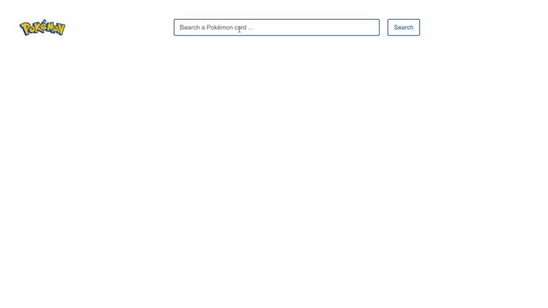

<div align="center">
  
  <br>
  <h3>Pokémon · <a target="_blank" href="https://pokemon.anth.ooo">voir le site</a></h3>
  
</div>

<br>

### 1- Description

Site qui permet de consulter n'importe quelle carte Pokémon grâce à l'API de [pokemontcg](https://pokemontcg.io/). Les recherches de Pokémon se font en anglais. Suite à la recherche, toutes les cartes portant ce nom s'affichent et il est possible de cliquer sur les cartes pour avoir des informations plus précises. Le site est responsive et il est possible de cliquer sur le logo de CardMarket pour avoir accès au site et ainsi pouvoir acheter la carte.

### 2- Fonctionnalités

- Rechercher des cartes Pokémon
- Cliquer sur une carte Pokémon et voir ses informations dans une autre page (nom, rareté, artiste, prix actuel, ...)
- Afficher le nombre de cartes selon la recherche

### 3- Démarrer le serveur

```
npm install
npm run serve
```
